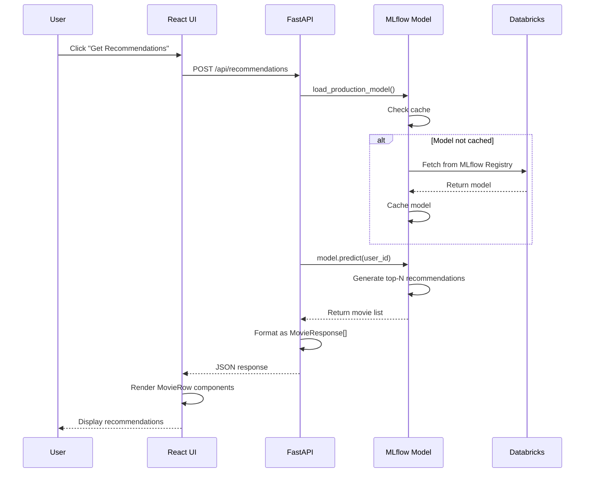
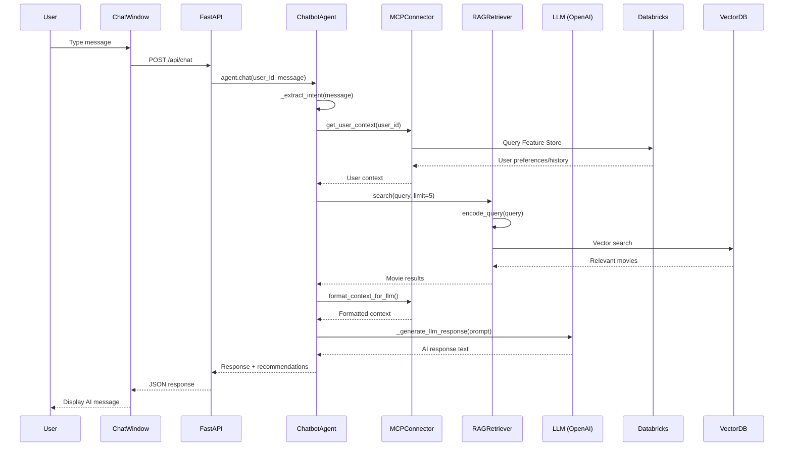
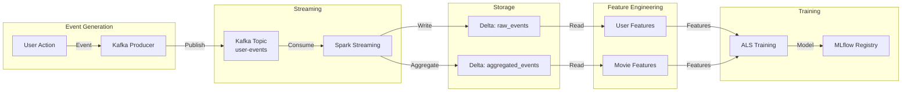

# 📚 RagFlix MLOps Platform - Comprehensive Documentation

> **A beginner-friendly guide to understanding the entire RagFlix project architecture, code structure, and workflows.**

---

## 📋 Table of Contents

1. [Overall Project Overview](#overall-project-overview)
2. [High-Level Architecture](#high-level-architecture)
3. [Data Flow & Control Flow](#data-flow--control-flow)
4. [Code Structure Explanation](#code-structure-explanation)
5. [Technical Flow Diagrams](#technical-flow-diagrams)
6. [Important Functions & Classes](#important-functions--classes)
7. [Setup and Usage Guide](#setup-and-usage-guide)
8. [Key Logic Explanation](#key-logic-explanation)
9. [Suggestions for Improvement](#suggestions-for-improvement)

---

## 🎯 Overall Project Overview

### What is RagFlix?

**RagFlix** is a **Netflix-style movie recommendation platform** that combines:
- **Big Data Processing** (Databricks + PySpark + Kafka)
- **Machine Learning** (Collaborative Filtering + Content-Based + Semantic Search)
- **AI Chatbot** (RAG-powered conversational recommendations)
- **Modern Web UI** (React + Tailwind CSS)

### Purpose & Functionality

The platform helps users discover movies through:
1. **Personalized Recommendations**: ML models learn from user behavior and preferences
2. **Semantic Search**: Find movies using natural language queries (e.g., "sci-fi movies with space battles")
3. **AI Chatbot**: Conversational interface that understands context and provides movie suggestions
4. **Real-time Learning**: System continuously learns from user interactions via Kafka streaming

### Main Components

```
┌─────────────────────────────────────────────────────────────┐
│                    Netflix-Style Web UI                      │
│              (React + Tailwind + Chat Window)                │
└───────────────────────┬─────────────────────────────────────┘
                        │ HTTP/REST API
                        ▼
┌─────────────────────────────────────────────────────────────┐
│                  FastAPI Gateway/Backend                     │
│         (Recommendations, Search, Chat Endpoints)            │
└───────────┬───────────────────────────────┬─────────────────┘
            │                               │
            ▼                               ▼
┌──────────────────────┐      ┌──────────────────────────┐
│   MCP Orchestrator   │      │    RAG Chat Engine        │
│ (Databricks + LLM)   │      │ (Vector Search + LLM)     │
└──────────┬───────────┘      └──────────────────────────┘
            │
            ▼
┌─────────────────────────────────────────────────────────────┐
│              Databricks ML Pipeline                          │
│    (PySpark + MLflow + Feature Store + Model Training)      │
└───────────┬─────────────────────────────────────────────────┘
            │
            ▼
┌─────────────────────────────────────────────────────────────┐
│         Kafka Stream + Delta Lake                           │
│    (Real-time Events → Training Data)                       │
└─────────────────────────────────────────────────────────────┘
```

---

## 🏗️ High-Level Architecture

### Layer 1: Presentation Layer (UI)
- **Technology**: React 18, Vite, Tailwind CSS, Framer Motion
- **Purpose**: User interface for browsing, searching, and chatting
- **Key Files**: `ui/src/pages/Home.jsx`, `ui/src/components/`

### Layer 2: API Gateway Layer
- **Technology**: FastAPI, Uvicorn
- **Purpose**: RESTful API endpoints, request routing, authentication
- **Key Files**: `serving_api/app.py`

### Layer 3: Business Logic Layer
- **MCP Connector**: Bridges Databricks models with LLM responses
- **RAG Agent**: Semantic search and conversational AI
- **Key Files**: `rag_agent/mcp_connector.py`, `rag_agent/chatbot_agent.py`

### Layer 4: Data Processing Layer
- **Technology**: PySpark, Delta Lake, Kafka
- **Purpose**: Real-time event streaming, feature engineering
- **Key Files**: `data_pipeline/`, `feature_store/`

### Layer 5: ML Pipeline Layer
- **Technology**: MLflow, PySpark MLlib, PyTorch
- **Purpose**: Model training, evaluation, registry, deployment
- **Key Files**: `model_pipeline/`

### Layer 6: Monitoring Layer
- **Technology**: Evidently AI, MLflow Dashboard
- **Purpose**: Data drift detection, model performance monitoring
- **Key Files**: `monitoring/`

---

## 🔄 Data Flow & Control Flow

### End-to-End Data Flow

```
1. USER INTERACTION
   └─> User clicks/views/rates a movie in UI
       │
       ▼
2. EVENT STREAMING
   └─> Kafka Producer sends event to Kafka topic
       │
       ▼
3. STREAM PROCESSING
   └─> Spark Streaming consumes events
       │
       ▼
4. DELTA LAKE STORAGE
   └─> Events written to Delta tables
       │
       ▼
5. FEATURE ENGINEERING
   └─> PySpark jobs compute user/movie features
       │
       ▼
6. MODEL TRAINING (Daily)
   └─> Airflow triggers training job
       │
       ▼
7. MODEL REGISTRY
   └─> Best model registered in MLflow
       │
       ▼
8. MODEL SERVING
   └─> FastAPI loads model for recommendations
       │
       ▼
9. USER RECOMMENDATIONS
   └─> UI displays personalized movies
```

### Recommendation Request Flow

```
User clicks "Get Recommendations"
    │
    ▼
UI: Home.jsx → axios.post('/api/recommendations')
    │
    ▼
FastAPI: app.py → get_recommendations()
    │
    ├─> load_production_model() [Loads from MLflow]
    │
    ├─> model.predict() [Generates recommendations]
    │
    └─> Returns MovieResponse[] to UI
    │
    ▼
UI: Displays movies in MovieRow components
```

### Chat Request Flow

```
User types message in ChatWindow
    │
    ▼
UI: ChatWindow.jsx → axios.post('/api/chat')
    │
    ▼
FastAPI: app.py → chat()
    │
    ├─> ChatbotAgent.chat()
    │   │
    │   ├─> _extract_intent() [Understands user intent]
    │   │
    │   ├─> MCPConnector.get_user_context() [Gets user data]
    │   │
    │   ├─> RAGRetriever.search() [Finds relevant movies]
    │   │
    │   └─> _generate_llm_response() [Generates AI response]
    │
    └─> Returns response + recommendations
    │
    ▼
UI: Displays AI response in chat window
```

---

## 📁 Code Structure Explanation

### Project Directory Tree

```
ragflix-mlops-platform/
│
├── 📂 data_pipeline/              # Real-time data streaming
│   ├── kafka_producer.py          # Sends user events to Kafka
│   ├── spark_stream_ingest.py    # Consumes Kafka → Delta Lake
│   └── airflow_dag.py            # Orchestrates daily jobs
│
├── 📂 feature_store/              # Feature engineering
│   ├── user_features.py          # Computes user behavior features
│   └── movie_features.py        # Computes movie popularity features
│
├── 📂 model_pipeline/             # ML training & tracking
│   ├── als_training.py           # Trains collaborative filtering model
│   ├── als_training.ipynb        # Jupyter notebook for training
│   ├── hybrid_reranker.py        # Combines multiple recommendation approaches
│   └── mlflow_tracking.py        # MLflow experiment tracking
│
├── 📂 serving_api/               # Backend API
│   ├── app.py                    # FastAPI application (MAIN ENTRY POINT)
│   ├── Dockerfile               # Container configuration
│   └── requirements.txt         # Python dependencies
│
├── 📂 rag_agent/                 # AI chatbot & search
│   ├── retriever.py             # Semantic search using vector DB
│   ├── mcp_connector.py         # Connects Databricks with LLM
│   └── chatbot_agent.py        # Conversational AI agent
│
├── 📂 ui/                        # Frontend React app
│   ├── src/
│   │   ├── main.jsx              # React entry point
│   │   ├── App.jsx              # Main app component
│   │   ├── pages/               # Page components
│   │   │   ├── Home.jsx         # Home page with recommendations
│   │   │   ├── Search.jsx       # Search page
│   │   │   └── Profile.jsx     # User profile page
│   │   └── components/         # Reusable components
│   │       ├── Navbar.jsx       # Navigation bar
│   │       ├── MovieCard.jsx    # Movie poster card
│   │       ├── MovieRow.jsx    # Horizontal movie row
│   │       └── ChatWindow.jsx   # AI chat interface
│   ├── package.json             # Node.js dependencies
│   └── vite.config.js          # Vite build configuration
│
├── 📂 monitoring/                # Monitoring & observability
│   ├── drift_detection.py       # Data drift detection
│   └── mlflow_metrics_dashboard.ipynb  # Metrics visualization
│
├── 📂 .github/workflows/        # CI/CD automation
│   └── mlops-pipeline.yml       # GitHub Actions workflow
│
├── README.md                    # Project overview
├── QUICKSTART.md               # Quick setup guide
├── requirements.txt           # Python dependencies
└── setup.sh / setup.ps1        # Setup scripts
```

### Main Entry Points

#### 1. **Backend API** (`serving_api/app.py`)
- **Entry Point**: `if __name__ == "__main__": uvicorn.run(app, host="0.0.0.0", port=8000)`
- **How to Run**: `uvicorn serving_api.app:app --reload`
- **What it does**: Starts FastAPI server, exposes REST endpoints

#### 2. **Frontend UI** (`ui/src/main.jsx`)
- **Entry Point**: `ReactDOM.createRoot(document.getElementById('root')).render(<App />)`
- **How to Run**: `cd ui && npm start`
- **What it does**: Renders React app, handles routing

#### 3. **Model Training** (`model_pipeline/als_training.py`)
- **Entry Point**: `if __name__ == "__main__": train_als_model()`
- **How to Run**: `python -m model_pipeline.als_training`
- **What it does**: Trains recommendation model, logs to MLflow

### Module Interactions

```
┌─────────────┐
│   UI (React)│
└──────┬──────┘
       │ HTTP Requests
       ▼
┌─────────────────────────────────────┐
│  FastAPI (serving_api/app.py)      │
│                                     │
│  ┌──────────────┐  ┌─────────────┐│
│  │ /api/recommend│  │ /api/chat   ││
│  │ ations        │  │             ││
│  └──────┬───────┘  └──────┬───────┘│
│         │                  │        │
│         ▼                  ▼        │
│  ┌──────────────┐  ┌─────────────┐│
│  │ MLflow Model │  │ ChatbotAgent││
│  └──────────────┘  └──────┬───────┘│
└────────────────────────────┼────────┘
                             │
                ┌────────────┼────────────┐
                │            │            │
                ▼            ▼            ▼
        ┌─────────────┐ ┌──────────┐ ┌──────────┐
        │ RAGRetriever│ │MCPConnector│ │MLflow   │
        └─────────────┘ └──────────┘ └──────────┘
                │            │            │
                ▼            ▼            ▼
        ┌─────────────┐ ┌──────────┐ ┌──────────┐
        │ Vector DB  │ │Databricks│ │Model Reg │
        └─────────────┘ └──────────┘ └──────────┘
```

---

## 📊 Technical Flow Diagrams

### Complete System Architecture

```mermaid
graph TB
    subgraph "Frontend Layer"
        UI[React UI<br/>Home/Search/Profile]
        Chat[Chat Window<br/>RAG Interface]
    end
    
    subgraph "API Layer"
        API[FastAPI Server<br/>app.py]
        EP1[/api/recommendations]
        EP2[/api/search]
        EP3[/api/chat]
    end
    
    subgraph "AI/ML Layer"
        MCP[MCP Connector<br/>Databricks Bridge]
        RAG[RAG Retriever<br/>Vector Search]
        Agent[Chatbot Agent<br/>LLM Integration]
        Model[MLflow Model<br/>Recommendation Engine]
    end
    
    subgraph "Data Layer"
        Kafka[Kafka Stream<br/>User Events]
        Spark[Spark Streaming<br/>Event Processing]
        Delta[Delta Lake<br/>Data Storage]
        FS[Feature Store<br/>User/Movie Features]
    end
    
    subgraph "ML Pipeline"
        Train[ALS Training<br/>Model Training]
        MLflow[MLflow Registry<br/>Experiment Tracking]
        Airflow[Airflow DAG<br/>Orchestration]
    end
    
    UI --> API
    Chat --> API
    API --> EP1
    API --> EP2
    API --> EP3
    EP1 --> Model
    EP2 --> RAG
    EP3 --> Agent
    Agent --> MCP
    Agent --> RAG
    RAG --> VectorDB[(Vector Database)]
    MCP --> Databricks[(Databricks)]
    Model --> MLflow
    Kafka --> Spark
    Spark --> Delta
    Delta --> FS
    FS --> Train
    Train --> MLflow
    Airflow --> Train
    Airflow --> FS
```

### Recommendation Generation Flow



### Chat Flow



### Data Pipeline Flow



---

## 🔧 Important Functions & Classes

### Backend API (`serving_api/app.py`)

#### `load_production_model()`
- **Purpose**: Loads the production ML model from MLflow registry
- **Returns**: Trained model object
- **Caching**: Caches model in memory to avoid repeated loads
- **Key Logic**:
  ```python
  1. Check if model in cache → return cached model
  2. Query MLflow for "Production" stage model
  3. Load model using mlflow.pyfunc.load_model()
  4. Cache model for future requests
  ```

#### `get_recommendations(request: RecommendationRequest)`
- **Purpose**: Generates movie recommendations for a user
- **Flow**:
  1. Load production model
  2. Call `model.predict()` with user_id
  3. Format results as `MovieResponse` objects
  4. Return JSON response

#### `search_movies(request: SearchRequest)`
- **Purpose**: Semantic search for movies
- **Flow**:
  1. Initialize `RAGRetriever`
  2. Call `retriever.search(query)`
  3. Return matching movies with relevance scores

#### `chat(request: ChatRequest)`
- **Purpose**: Handle conversational AI requests
- **Flow**:
  1. Initialize `ChatbotAgent`
  2. Call `agent.chat(user_id, message)`
  3. Return AI response + recommendations

### RAG Agent (`rag_agent/chatbot_agent.py`)

#### `ChatbotAgent` Class
- **Purpose**: Main conversational AI agent
- **Key Methods**:
  - `__init__()`: Initializes LLM client, RAG retriever, MCP connector
  - `chat()`: Main method that processes user messages
  - `_extract_intent()`: Understands user intent (search, recommendation, etc.)
  - `_generate_llm_response()`: Calls LLM API to generate responses

#### `chat()` Method Flow:
```
1. Extract intent from message
2. Get user context from MCP connector
3. Search for relevant movies using RAG
4. Format context for LLM
5. Generate AI response
6. Return response + recommendations
```

### Model Training (`model_pipeline/als_training.py`)

#### `train_als_model()` Function
- **Purpose**: Trains ALS collaborative filtering model
- **Parameters**:
  - `rank`: Number of latent factors (default: 10)
  - `max_iter`: Training iterations (default: 10)
  - `reg_param`: Regularization strength (default: 0.1)
- **Flow**:
  1. Load ratings data from Delta Lake
  2. Split into train/test (80/20)
  3. Initialize ALS model with hyperparameters
  4. Train model on training set
  5. Evaluate on test set (RMSE, MAE, Precision@10)
  6. Log metrics to MLflow
  7. Save model to MLflow registry

#### `calculate_precision_at_k()` Function
- **Purpose**: Calculates recommendation quality metric
- **Logic**: 
  - Gets top-K recommendations per user
  - Checks how many match high-rated movies (rating >= 4) in test set
  - Returns: `hits / total_recommendations`

### Data Pipeline (`data_pipeline/kafka_producer.py`)

#### `UserEventProducer` Class
- **Purpose**: Sends user events to Kafka for real-time processing
- **Key Methods**:
  - `send_rating()`: Sends movie rating event
  - `send_view()`: Sends movie view/watch event
  - `send_click()`: Sends click/interaction event
- **Event Format**:
  ```json
  {
    "user_id": 1,
    "movie_id": 100,
    "event_type": "rating",
    "timestamp": "2024-01-01T12:00:00",
    "metadata": {"rating": 4.5}
  }
  ```

### Feature Store (`feature_store/user_features.py`)

#### `UserFeatureStore` Class
- **Purpose**: Computes and stores user behavioral features
- **Key Methods**:
  - `compute_user_features()`: Calculates user activity metrics
  - `compute_user_movie_interaction_features()`: User-movie interaction history
  - `refresh_features()`: Refreshes all features and writes to Feature Store
- **Features Computed**:
  - Total events, views, ratings, clicks
  - Average rating, max/min ratings
  - Days since last activity
  - User tenure (days active)

### Frontend Components (`ui/src/`)

#### `Home.jsx`
- **Purpose**: Main landing page with recommendations
- **Key Features**:
  - Hero section with featured movie
  - "Continue Watching" row
  - "Recommended for You" row
  - "Trending Now" row
  - Chat button (opens ChatWindow)

#### `ChatWindow.jsx`
- **Purpose**: AI chatbot interface
- **Features**:
  - Message history display
  - Input field with send button
  - Loading indicators
  - Displays recommendations in chat

#### `MovieCard.jsx`
- **Purpose**: Individual movie poster card
- **Features**:
  - Hover effects (scale, overlay)
  - Play and Info buttons on hover
  - Movie title and rating display

#### `MovieRow.jsx`
- **Purpose**: Horizontal scrolling row of movies
- **Features**:
  - Left/right scroll buttons
  - Smooth scrolling animation
  - Renders multiple MovieCard components

---

## 🚀 Setup and Usage Guide

### Prerequisites

- **Python 3.9+**
- **Node.js 18+**
- **Databricks account** (or local Spark setup)
- **Kafka** (optional, for streaming)
- **PostgreSQL/Vector DB** (for RAG - Pinecone/Chroma)

### Installation Steps

#### 1. Clone Repository
```bash
git clone <your-repo-url>
cd ragflix-mlops-platform
```

#### 2. Setup Python Environment
```bash
# Create virtual environment
python -m venv venv

# Activate (Linux/Mac)
source venv/bin/activate

# Activate (Windows)
venv\Scripts\activate

# Install dependencies
pip install -r requirements.txt
```

#### 3. Setup Frontend
```bash
cd ui
npm install
cd ..
```

#### 4. Configure Environment
Create `.env` file in root directory:
```bash
# Databricks
DATABRICKS_HOST=your-databricks-host.cloud.databricks.com
DATABRICKS_TOKEN=your-token
DATABRICKS_CLUSTER_ID=your-cluster-id

# Kafka (optional)
KAFKA_BOOTSTRAP_SERVERS=localhost:9092
KAFKA_TOPIC=user-events

# MLflow
MLFLOW_TRACKING_URI=databricks
MLFLOW_EXPERIMENT_NAME=ragflix-recommendations

# LLM (optional)
OPENAI_API_KEY=your-openai-key

# Vector DB (optional)
PINECONE_API_KEY=your-pinecone-key
```

#### 5. Prepare Data
- Download MovieLens dataset (ratings.csv, movies.csv)
- Upload to Databricks Delta tables:
  - `ratings`: user_id, movie_id, rating, timestamp
  - `movies`: movie_id, title, genres, year

#### 6. Start Services

**Terminal 1 - API Server:**
```bash
cd serving_api
uvicorn app:app --reload --port 8000
```

**Terminal 2 - Frontend:**
```bash
cd ui
npm start
```

**Terminal 3 - Kafka Producer (optional):**
```bash
python -m data_pipeline.kafka_producer
```

#### 7. Train Model
```bash
# In Databricks notebook or locally:
python -m model_pipeline.als_training
```

### Access Points

- **Frontend UI**: http://localhost:3000
- **API Server**: http://localhost:8000
- **API Documentation**: http://localhost:8000/docs
- **Health Check**: http://localhost:8000/health

### Testing

```bash
# Test API health
curl http://localhost:8000/health

# Test recommendations
curl -X POST http://localhost:8000/api/recommendations \
  -H "Content-Type: application/json" \
  -d '{"user_id": 1, "num_recommendations": 10}'

# Test search
curl -X POST http://localhost:8000/api/search \
  -H "Content-Type: application/json" \
  -d '{"query": "sci-fi movies", "limit": 5}'
```

---

## 🧠 Key Logic Explanation

### 1. Collaborative Filtering (ALS Algorithm)

**What it does**: Predicts user preferences based on similar users' behavior.

**How it works**:
1. **Matrix Factorization**: Decomposes user-movie rating matrix into two smaller matrices:
   - User factors (what users like)
   - Movie factors (what movies are about)
2. **Learning**: Alternates between fixing user factors and learning movie factors (and vice versa)
3. **Prediction**: Multiplies user factors × movie factors = predicted rating

**Example**:
```
User 1 rates Movie A: 5 stars
User 2 rates Movie A: 4 stars
User 1 rates Movie B: 5 stars
→ System learns: User 1 and User 2 have similar taste
→ System predicts: User 2 might rate Movie B: 4-5 stars
```

**Code Location**: `model_pipeline/als_training.py`

### 2. RAG (Retrieval-Augmented Generation)

**What it does**: Combines semantic search with LLM to provide accurate, context-aware responses.

**How it works**:
1. **Retrieval**: User query → Convert to vector embedding → Search vector database for similar movies
2. **Augmentation**: Add retrieved movie context to LLM prompt
3. **Generation**: LLM generates response using retrieved context

**Example**:
```
User: "I want sci-fi movies with space battles"
  ↓
RAG: Searches vector DB for movies with "sci-fi" + "space" + "battles"
  ↓
RAG: Finds: Star Wars, Interstellar, The Expanse
  ↓
LLM: "Based on your interest in sci-fi space battles, I recommend..."
```

**Code Location**: `rag_agent/retriever.py`, `rag_agent/chatbot_agent.py`

### 3. Hybrid Recommendation System

**What it does**: Combines multiple recommendation approaches for better accuracy.

**Components**:
1. **Collaborative Filtering** (50% weight): Based on user-user similarity
2. **Content-Based** (30% weight): Based on genre/movie features
3. **Semantic Similarity** (20% weight): Based on movie descriptions/embeddings

**Scoring Formula**:
```
Final Score = 0.5 × ALS_Score + 0.3 × Content_Score + 0.2 × Semantic_Score
```

**Code Location**: `model_pipeline/hybrid_reranker.py`

### 4. Real-time Event Streaming

**What it does**: Captures user interactions in real-time for continuous learning.

**Flow**:
```
User clicks movie → Kafka Producer → Kafka Topic → Spark Streaming → Delta Lake
                                                                    ↓
                                                          Feature Store Update
                                                                    ↓
                                                          Model Retraining (Daily)
```

**Code Location**: `data_pipeline/kafka_producer.py`, `data_pipeline/spark_stream_ingest.py`

### 5. Feature Engineering

**User Features**:
- Activity metrics: total events, views, ratings
- Rating statistics: average, max, min ratings
- Temporal features: days since last activity, user tenure

**Movie Features**:
- Popularity: total views, ratings, unique users
- Content: genres, release year, description
- Temporal: trending score (recent activity)

**Code Location**: `feature_store/user_features.py`, `feature_store/movie_features.py`

### 6. Model Training Workflow

**Daily Automated Process** (via Airflow):
```
1. Refresh Feature Store (compute latest features)
   ↓
2. Train ALS Model (with latest data)
   ↓
3. Evaluate Model (RMSE, MAE, Precision@10)
   ↓
4. Check if metrics meet threshold
   ↓
5. Register Model in MLflow (if good)
   ↓
6. Promote to Production (if better than current)
   ↓
7. Deploy (restart API to load new model)
```

**Code Location**: `data_pipeline/airflow_dag.py`

---

## 💡 Suggestions for Improvement

### 1. **Performance Optimizations**

#### Model Caching
- **Current**: Model loaded on first request
- **Improvement**: Pre-load model on API startup
- **Location**: `serving_api/app.py` → `load_production_model()`

#### Database Connection Pooling
- **Current**: New connections for each request
- **Improvement**: Use connection pooling for Databricks queries
- **Location**: `rag_agent/mcp_connector.py`

#### Frontend Code Splitting
- **Current**: All components loaded at once
- **Improvement**: Lazy load routes and components
- **Location**: `ui/src/App.jsx`

### 2. **Error Handling**

#### Add Retry Logic
```python
# In serving_api/app.py
from tenacity import retry, stop_after_attempt

@retry(stop=stop_after_attempt(3))
def load_production_model():
    # ... existing code
```

#### Better Error Messages
- Add user-friendly error messages in UI
- Log detailed errors server-side
- Return appropriate HTTP status codes

### 3. **Security Enhancements**

#### Authentication & Authorization
- Add JWT token authentication
- Implement user roles (admin, user)
- Rate limiting for API endpoints

#### Input Validation
- Sanitize user inputs
- Validate API request parameters
- SQL injection prevention

### 4. **Monitoring & Observability**

#### Add Metrics
- Request latency tracking
- Model prediction latency
- Error rate monitoring
- User engagement metrics

#### Logging
- Structured logging (JSON format)
- Log aggregation (ELK stack, Datadog)
- Request tracing (OpenTelemetry)

### 5. **Testing**

#### Unit Tests
- Test individual functions/classes
- Mock external dependencies
- Test edge cases

#### Integration Tests
- Test API endpoints
- Test data pipeline flows
- Test model training pipeline

#### E2E Tests
- Test complete user flows
- UI automation (Playwright, Cypress)

### 6. **Scalability**

#### Horizontal Scaling
- Deploy API with multiple instances
- Load balancer (nginx, AWS ALB)
- Stateless API design (already done)

#### Caching
- Redis for frequently accessed data
- Cache user recommendations
- Cache movie metadata

#### Database Optimization
- Index frequently queried columns
- Partition Delta tables by date
- Use Delta Lake Z-ordering

### 7. **Feature Enhancements**

#### Personalization
- User preference learning
- A/B testing framework
- Multi-armed bandit for exploration

#### Social Features
- Friend recommendations
- Watch parties
- Reviews and ratings

#### Content Discovery
- Trending algorithms
- Category-based browsing
- Similar movies recommendations

### 8. **Code Quality**

#### Type Hints
- Add type hints to all functions
- Use mypy for type checking

#### Documentation
- Add docstrings to all functions
- API documentation (OpenAPI/Swagger)
- Architecture decision records (ADRs)

#### Code Formatting
- Use Black for Python formatting
- Use Prettier for JavaScript
- Pre-commit hooks

---

## 📖 Additional Resources

### Learning Path

1. **Understanding the Basics**:
   - Read `README.md` for overview
   - Review `QUICKSTART.md` for setup
   - Explore `ui/src/` to understand frontend

2. **Deep Dive into Components**:
   - Start with `serving_api/app.py` (API layer)
   - Move to `rag_agent/` (AI components)
   - Study `model_pipeline/` (ML training)

3. **Data Flow Understanding**:
   - Trace a recommendation request end-to-end
   - Follow a chat message through the system
   - Understand the training pipeline

### Key Files to Study

1. **`serving_api/app.py`** - API entry point, request handling
2. **`rag_agent/chatbot_agent.py`** - AI logic, LLM integration
3. **`model_pipeline/als_training.py`** - ML model training
4. **`ui/src/pages/Home.jsx`** - Frontend main page
5. **`data_pipeline/airflow_dag.py`** - Workflow orchestration

### Common Modifications

#### Adding a New API Endpoint
1. Add route in `serving_api/app.py`
2. Create Pydantic model for request/response
3. Implement business logic
4. Test with curl or Postman

#### Adding a New UI Page
1. Create component in `ui/src/pages/`
2. Add route in `ui/src/App.jsx`
3. Add navigation link in `ui/src/components/Navbar.jsx`

#### Modifying Recommendation Algorithm
1. Edit `model_pipeline/hybrid_reranker.py`
2. Adjust weights or add new features
3. Retrain model
4. Deploy new model version

---

## 🎓 Conclusion

This documentation provides a comprehensive overview of the RagFlix MLOps platform. The system is designed with modularity in mind, making it easy to:

- **Understand**: Clear separation of concerns
- **Extend**: Add new features without breaking existing ones
- **Maintain**: Well-structured code with logging and error handling
- **Scale**: Designed for horizontal scaling

**Next Steps**:
1. Set up the project locally
2. Run through the quick start guide
3. Experiment with different components
4. Read the code comments for implementation details
5. Start making modifications!

**Questions?** Check the code comments, README files, or explore the codebase - everything is well-documented!

---

*Last Updated: 2024*
*Version: 1.0.0*

